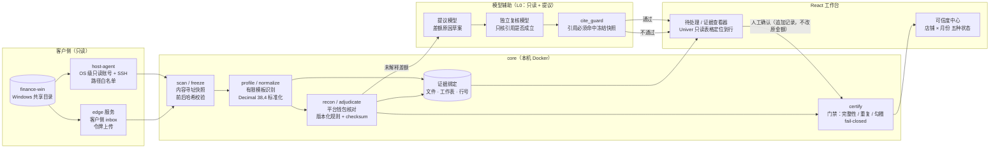

# 电商财务对账 Harness

**多平台电商的月度对账：金额只由确定性代码算，LLM 只能提出带证据引用的候选，不能改账、不能绕过门禁。**
## 这个项目在解决什么

一家多店铺电商公司，淘宝 / 天猫 / 拼多多 / 京东 / 抖店 / 1688 几十家店，每月交上来的是各平台导出的 Excel、支付宝 / 微信流水、聚水潭成本表。老板想知道的只有一件事：**这个月每家店的账能不能信。**

过去靠 Power BI + 人工。问题不在算得慢，而在三处：出错时不知道错在哪一行；每月口径悄悄漂移；上了 LLM 之后"模型说对上了"和"账真的对上了"分不清。

这个仓库的回答是一套 Harness：把采集、冻结、识别、标准化、核对、裁决、认证拆成可复现的阶段，每个阶段只做一件事，每个数字都能追到文件、工作表和行号，LLM 只在"解释差额"这一步被允许发言，而且它的每句解释都要通过引用核验。

## 架构



另有一个独立子系统 [`ledger/`](ledger/)：规则写在 YAML 模型里而不是代码里的损益引擎，店长拖表进去就出损益表，并先告诉你这个月能不能结账、缺什么。

## 截图

| 可信度中心（设计稿，示例数据） | 对账控制台（设计稿，示例数据） |
| --- | --- |
|  |  |

<!-- TODO: 补一张真实运行截图（店铺名、金额、人名全部脱敏或替换为示例数据后再提交）。 -->

## 我在这个项目里解决的落地难点

面试时常被问"LLM 进财务系统怎么控风险"，这个项目里的答案都是代码，不是 PPT：

1. **把"准确"定义成可验收的东西，而不是模型感觉。** 一个数字要进"可以使用"，必须同时满足：原始文件已按内容冻结且能追到行；店铺 / 月份 / 金额由确定性代码识别并过完整性、重复、勾稽门禁；差额由人确认过且确认记录只追加不覆盖。模型说什么都不改变这五个条件。页面只显示"可以使用 / 还差文件 / 金额对不上 / 等待确认 / 正在整理"之一，不用"任务成功""容器健康""模型给出解释"冒充账已对平。

2. **证据链 fail-closed。** 差额可以展开到原始文件、压缩包成员、工作表、真实行号；缺文件、缺行号、XLSX 缺工作表时直接失败，不退回"第 1 行"。旧结果从 JSON 恢复出的线索只能标"历史线索"，不能当精准定位，也不能据此自动确认。

3. **LLM 只有提议权和挑错权。** 提议模型生成差额原因草案，必须引用当前正式冻结版本的文件 / 工作表 / 行；独立复核模型只检查引用是否成立。两者模型标识不同才算"独立复核"，否则明确降级为"仍需人工确认"，不把单模型自我确认包装成复核。模型停用、超时、限流时，确定性路径继续跑，由测试覆盖。

4. **客户数据不出客户机器。** finance-win 用 OS 级只读账号 + 独立 SSH 别名；容器启动时只把指定私钥复制到 tmpfs 并收紧 0600，不写回宿主；edge 服务跑在客户侧，用共享令牌向 core 上传，令牌未设置时服务不启动。工作数据目录 `~/fa-workbench` 永不进 Git。

5. **多店多月不混算。** 调度按"平台 + 逻辑店铺 + 月份"隔离，一个范围失败不拖累别的店；每个店铺在冻结时获得独立稳定身份，"2月""十二月份"这类目录名会被拒绝为店铺身份、进入待确认。代码、规则、范围都没变时整轮重算幂等跳过。

6. **规则漂移可阻断。** 规则带版本号和 checksum，执行器和规则不匹配时核对直接停；人工修正只进"学习策略"的样本池，形成跨账期盲测真值前不会自动晋升成正式规则。

7. **诚实地说"还没做到"。** README 下方「明确未启用」一节列了所有没做的事：AI 写金额、PBIX 自动转换、万能解析器、把接受率当准确率、多租户、正式人员绩效。这些不是谦虚，是边界。

---

本仓库正在从“通用经营数据平台”收敛为电商财务对账的垂直 Harness。当前产品核心不是
看板或万能数据工具，而是可复现的对账合同、版本化规则、账期状态机、差额处置和证据链。

正式金额只由确定性代码使用 `Decimal(38,4)` 计算。LLM 只能提出带证据引用的候选，
不能计算金额、改写账本或绕过确定性门禁。

## 当前可验证状态

新实现位于 [`harness/`](harness/)，工作数据位于仓库外的 `~/fa-workbench`。
截至 2026-07-27 的本机验证：

- finance-win 使用独立 OS 级只读账号和 SSH 别名 `finance-win-ro`；
- Docker 已完成 finance-win 只读清单扫描；文件数量、候选范围和字节数属于每次清单周期的
  快照，不在文档中冒充实时值，以页面及 `/api/v1/compute/jobs` 当前结果为准；
- 内容寻址快照不可覆盖，重复源版本会复用；代码、规则和范围未变化时整轮计算幂等跳过；
- 有限订单、支付宝/微信、费用、成本模板参与确定性标准化；无法唯一识别的文件进入待处理；
- 规则带版本和 checksum，执行器漂移会阻断；未命中或歧义不会改变原始金额；
- 自动调度按“平台 + 逻辑店铺 + 月份”隔离执行，某一范围失败不会跨店混算；
- React 工作台显示经营范围、实时任务、核对余额、待处理问题和模型真实调用状态；
- 差额可展开到原始文件、压缩包成员、工作表和行号；新产生的核对结果会冻结一对多证据绑定。
  旧结果从既有 JSON 恢复出的文件和行只能标记为“历史线索”，不会显示为精准定位，也不能据此
  自动确认；
- 当前正式证据规则为 `finite-normalization-v5`。旧版本绑定继续保留供审计，但必须从不可变
  原始快照重新处理后，才能进入模型引用门禁或认证人员绩效；缺文件、缺真实行号或 XLSX 缺工作表
  都会失败关闭，不会退回第 1 行；
- finance-win 的员工表、运营链接和 2026 历史绩效输出进入独立参考层，用于校验
  “人员—店铺—商品—月份”归属和旧公式，不会直接写入认证经营结果；
- 无外部模型、API Key 错误或模型限流时，封存、标准化、核对和看板读取继续运行。

最后一次全量重算覆盖 65 个“平台 + 逻辑店铺”和 2026-02 至 2026-07 共 390 个店铺月份：
盘点 1 次、封存 1 次、画像 1 次、标准化 65 次、核对 390 次，共 458 个任务全部技术成功；
随后无变更检查只执行盘点并正确跳过重算。业务门禁并未因此被放宽：160 个范围仍在等待来源，
其余 230 个范围已形成计算结果但尚未通过认证。阻断原因会重叠，包括 83 个存在未解释差额、
137 个应到清单不完整、5 个存在候选修订、154 个缺订单或平台钱包一侧、68 个控制差额失败。
当前没有店铺月份通过全部认证门禁，因此也没有认证人员绩效结果。

这不等于所有账期已完成正式对账。系统不会把“文件已发现”“任务技术成功”“容器健康”或
“LLM 给出解释”冒充账已对平；看板中的待复核金额只能用于定位问题，不能当作正式经营结论。

## 可信度中心与证据查看

“数据可信度”按“逻辑店铺 × 月份”展示当前状态，只使用当前真实计算结果，不用容器健康或
模型说明替代业务门禁。每个店铺月份只会显示以下一种状态：

- **还差文件**：应到文件缺失、文件处理失败，或者当前还没有可用于整理的原始文件；
- **金额对不上**：已有文件之间仍存在未核销记录或金额差额；
- **等待确认**：文件和计算已经完成，但文件版本或业务情况仍需人工确认；
- **正在整理**：该店铺月份的本机计算尚未完成；
- **可以使用**：当前已配置的文件、金额核对和必要确认均已通过系统检查。

“可以使用”只表示通过本产品当前配置的系统门禁，可以用于当前经营查看，**不表示已经发生
人工批准或正式发布，也不是外部审计意见、审计报告或法定财务结论**。当前真实运行仍存在
缺文件、金额差额和待确认的店铺月份，不能把可信度页面已能显示状态理解为全部账期已经可用。

待处理问题可继续打开原始依据。系统从内容寻址快照中按绑定关系定位原始文件、压缩包成员、
Excel 工作表和真实来源行号，并只读取目标行附近的有界窗口。CSV/XLSX 预览使用 Univer
只读表格查看器，目标行会被定位，但不能在页面中编辑原文件、保存回来源目录或执行工作簿公式。
历史结果若缺少足够的正式绑定，只能显示“历史推断”或“无法恢复”，不能伪造精确行号。

行级问题量很大时，经营者页面不会平铺技术记录。系统先按“店铺 × 月份 × 业务原因”归并为
问题组，显示影响金额和原始记录数；选择一组后才逐条查看，并可继续打开对应快照、工作表和行号。
分组只改变阅读方式，不合并、删除或自动裁决底层证据。

## 本机 Docker 工作台

扫描、不可变快照、有限模板识别、标准化和确定性核对均由本机 Docker 自动执行。
finance-win 仍使用 OS 级只读账号；宿主 SSH 目录以只读方式挂载到 `/run/ssh-host`，
启动时只把指定配置、私钥和 `known_hosts` 复制到
容器专用 tmpfs 并收紧为 `0600`，不会写回宿主密钥或 finance-win 原始目录。

默认业务范围为全部确定识别的平台和逻辑店铺，从 `2026-02` 自动滚动到当前月。当前月
明确标记为进行中；没有业务文件的店铺月份仍生成缺件任务，但不会产生正式金额。

```bash
export FA_WORKBENCH_BIND=//home/wsfwk/fa-workbench
export FA_CONNECTION_DIR=/home/wsfwk/fa-workbench/ssh
export FA_SSH_DIR=/home/wsfwk/.ssh
export FA_EDGE_TOKEN="$(openssl rand -hex 32)"
docker compose -f compose.harness.yaml up -d --build
```

两个服务分别是 `core`（内核与页面，8765）和 `edge`（只读客户侧 inbox，8766）；
`FA_EDGE_TOKEN` 是二者之间的上传令牌，未设置时不会启动。

`FA_WORKBENCH_BIND` 的双斜杠是有效 POSIX 路径，同时避免 Docker Desktop Compose
把可写 WSL 目录误改写为无效 UNC 卷名。默认路径与上面一致，不修改路径时可不设置三个变量。
具体配置见
[`docs/harness-deployment.md`](docs/harness-deployment.md)。

打开 <http://127.0.0.1:8765>。就绪检查为
<http://127.0.0.1:8765/readyz>，OpenAPI 为
<http://127.0.0.1:8765/api/docs>。

启动后无需手工执行 CLI。页面中的“重新检查全部店铺”会调用
`POST /api/v1/compute/run`；`GET /api/v1/progress` 和
`GET /api/v1/compute/jobs` 返回持久化的等待、运行、成功和失败状态。

“模型辅助”页支持填入 OpenAI-compatible 或 Anthropic 协议地址和 API Key，也可选择
自动识别协议。系统先从服务端读取真实模型列表，选择后才允许应用；配置写入仓库外
工作台，然后执行一次不含业务数据的真实模型调用。最近调用状态会持续显示在页面上；
在“待处理”中可让模型生成业务说明草案，但草案必须人工确认且不能修改金额。API Key
不会由后端返回浏览器，停用、超时、限流或调用失败时确定性核对继续运行。

模型配置可分别选择“提议模型”和“独立复核模型”。提议模型负责生成带原始依据引用的候选
说明；复核模型只检查候选是否被给定证据支持。只有两者模型标识不同才显示为独立复核；
未配置复核模型、两者相同、复核失败或引用未通过核验时，系统都会明确降级为仍需人工确认，
不会把单模型自我确认包装成独立复核。两个模型都只有提议和挑错权限，不能写入正式金额、
账本、规则状态或“可以使用”结论。

“模型辅助”中的 L0 是写入权限边界，不代表只有一种简单能力。当前可分别查看只读发现、
有限模板路由、月份/店铺识别、金额标准化与去重、平台钱包核对、证据定位、差额原因草案、
引用核验、人工修正学习、历史对比、人员商品归属参考核验和规则晋升评估的真实状态。
其中当前真正接入外部模型的页面能力只有“差额原因草案 + 独立复核”；资料归类、字段映射、
关联建议和规则草案仍只是受控策略定义，尚未作为用户能力启用。模型建议及人工修正会追加记录。
学习策略 `autonomy-learning-v2` 会在每次评估时重新核验当前 v5 全量证据摘要；证据被增删、替换、
降级，或独立复核未通过的样本都不计入准确样本。旧策略的晋升资格会在升级时撤销，在形成跨账期
盲测真值前不会自动晋升为正式规则。

人员绩效页当前明确标为“历史参考”：运营链接提供 2026 年 2–5 月商品归属，历史工资 CSV
提供店铺、人员、商品和旧公式结果。只导入 2026-02 之后的人员×商品明细；同目录中的店铺
汇总表继续保留为原始证据，但不会伪装成人员绩效。平台不适用的空费用列按零值进入公式复核。
2026 年 6 月及以后归属列为空时，系统显示归属不完整，不会静默沿用 5 月负责人；员工别名
未与员工主表唯一匹配时保持临时身份。历史绩效文件产生的归属、临时人员和临时商品都被认证
引擎硬阻断，不能反向把旧工资结果证明成新的正式事实。正式绩效必须等待认证账本产生商品粒度结果并通过
版本化绩效政策校验。商品粒度金额只接受文件中明确的商品 ID，或订单号能唯一映射到一个商品 ID
的证据；无法唯一归属的平台费、运费、广告费或成本保留在“未归属金额”中，绝不按销量或销售额猜分。
只有销售、退款、平台费、广告费、运费和成本六项均有直接证据时，才计算该商品利润并进入人员绩效
候选。

### “智能准确”在本产品中的验收含义

本产品不把“模型回答得像真的”称为准确。一个经营数字只有同时满足以下条件才进入可使用范围：

1. 原始文件已按内容冻结，且能追溯到文件、工作表和真实行；
2. 店铺、月份、业务键和金额由确定性代码识别并通过完整性、重复和勾稽门禁；
3. 商品或人员归属有直接证据且在当前账期生效；共享费用没有直接证据时保持未归属；
4. 待处理差额已经由人确认业务事实，确认记录追加保存，原金额不被改写；
5. 模型草案只能引用当前 `finite-normalization-v5` 正式冻结的文件、工作表和行；旧版本绑定、
   旧 JSON 线索或同组混有无效绑定都不能通过引用门禁。学习 v2 会重验完整绑定摘要，独立复核
   未通过或证据后来发生变化的样本不能进入规则晋升；无论通过与否都不能写正式账本。

当前人员绩效执行器为 `certified-person-performance-v2`。schema 15 会撤销旧证据策略或旧 v1
引擎生成的 current head，旧结果只保留为 superseded 审计记录；“认证绩效可用”严格服从页面
当前选择的店铺和月份。

因此页面会诚实显示“可以使用、还差文件、金额要核对、等待确认、正在整理”之一。系统无法证明的
事项继续阻断，不用接受率、公式复现率、模型共识或容器健康冒充业务准确率。

容器启动后可执行一条不改账本的本机自检：

```bash
scripts/verify-harness.sh
```

该脚本核对真实数据模式、钱包核对范围、银行“不适用”状态、只读来源边界，以及待处理
清单的 CSV MIME、文件名和 UTF-8 BOM；它不会把真实明细写入仓库。

最后一次真实模型连接验证使用页面当前选择的 `deepseek-v4-pro`，服务端返回成功并记录请求
状态；该结果只证明模型连接可用，不证明任何经营数字正确。关闭模型或模型调用失败的确定性路径
由自动化测试覆盖，验证时不会覆盖操作者已经保存的模型配置。

容器端口被固定映射到主机回环地址。当前工作台没有用户认证，禁止修改 Compose
把它直接暴露到局域网。

## 只读采集与冻结

真实配置必须放在仓库外：

```bash
cp harness/config.example.toml ~/fa-workbench/config.toml
PYTHONPATH=harness:host-agent harness/.venv/bin/python -m commerce_harness \
  --config ~/fa-workbench/config.toml scan --workspace ~/fa-workbench
PYTHONPATH=harness:host-agent harness/.venv/bin/python -m commerce_harness \
  --config ~/fa-workbench/config.toml freeze --workspace ~/fa-workbench
PYTHONPATH=harness:host-agent harness/.venv/bin/python -m commerce_harness \
  --config ~/fa-workbench/config.toml profile --workspace ~/fa-workbench
PYTHONPATH=harness:host-agent harness/.venv/bin/python -m commerce_harness \
  --config ~/fa-workbench/config.toml normalize --workspace ~/fa-workbench \
  --store <稳定店铺ID>
PYTHONPATH=harness:host-agent harness/.venv/bin/python -m commerce_harness \
  --config ~/fa-workbench/config.toml adjudicate --workspace ~/fa-workbench
PYTHONPATH=harness:host-agent harness/.venv/bin/python -m commerce_harness \
  --config ~/fa-workbench/config.toml recon --workspace ~/fa-workbench \
  --period 2604 --store <稳定店铺ID>
PYTHONPATH=harness:host-agent harness/.venv/bin/python -m commerce_harness \
  --config ~/fa-workbench/config.toml diff --workspace ~/fa-workbench \
  --period 2604 --store <稳定店铺ID>
PYTHONPATH=harness:host-agent harness/.venv/bin/python -m commerce_harness \
  --config ~/fa-workbench/config.toml baseline --workspace ~/fa-workbench \
  --period 2604 --store <稳定店铺ID>
```

`scan` 只读取元数据；`freeze` 以流式方式复制到内容寻址快照并核对源文件前后
mtime/哈希；`profile` 只在有限模板中识别，不做开放式猜测。`normalize` 完成后会
自动执行幂等证据裁决；`adjudicate` 可独立重放同一策略。`recon`、`diff` 和
`baseline` 分别负责诊断核对、历史对表和候选基线。正式
`baseline --freeze` 会在代码未提交、门禁未通过或证据不完整时拒绝执行。

多店环境下，`freeze` 会为每个发现或显式配置的店铺建立独立稳定身份；后续金额命令必须带
`--store`。系统不会在同月多个店铺之间自动挑选一个账期。看板会列出全部发现店铺，但未完成
该店铺处理与门禁的数据不会进入金额汇总。旧单店配置保持兼容，可以省略 `--store`。

月份目录名只能帮助识别覆盖时间，不能成为店铺身份。诸如“2月”“十二月份”或纯日期、纯编号
目录会被拒绝为店铺候选并进入待确认。重新发现范围时，已经不在当前目标计划中的旧店铺合同会
被标记为停用并记录结束日期；既有账期、运行记录、快照和证据继续保留，历史结果不会因当前范围
停用而被物理删除。

默认配置使用 `platform_wallet`：支付宝、微信流水作为平台钱包证据，与订单侧做
确定性核对；同一钱包记录不会同时冒充“平台腿”和“银行资金腿”。银行流水在此模式下
明确为“不适用”。只有客户确实提供独立银行流水和稳定结算批次桥接规则时，才可改用
`bank_three_way`。

## 验证

```bash
PYTHONPATH=harness:host-agent harness/.venv/bin/python -m pytest harness/tests \
  --cov=commerce_harness --cov-report=term-missing --cov-fail-under=85
PYTHONPATH=host-agent harness/.venv/bin/python -m pytest host-agent/tests \
  --cov=finance_agent --cov-report=term-missing --cov-fail-under=80

cd harness/web
npm ci
npm test -- --run
npm run typecheck
npm run build

cd ../..
docker compose -f compose.harness.yaml config --quiet
```

两套 Python 测试必须分开执行，因为它们都含有同名的 `test_config.py`；一次传入两个
测试目录会触发 pytest 模块名收集冲突，这不是产品测试失败。

## 目录边界

- `harness/`：新对账限界上下文、确定性内核、账本、API 和轻前端。
- `host-agent/`：finance-win 只读连接器和路径安全策略。
- `~/fa-workbench`：客户快照、Parquet、DuckDB、报告和模型日志；永不进入 Git。
- `backend/`、`apps/web/`：上一轮通用平台代码，仅作迁移参考。

旧平台代码不会在当前工作中继续扩展，也不会在黄金基线和盲测前贸然删除。删除条件见
[`docs/harness-refactor.md`](docs/harness-refactor.md)。

## 明确未启用

- AI 写入金额、正式账本、认证结论，或绕过确定性门禁；
- PBIX 运行时、PBIX 自动转换、PBIX 自动转 PBIP 或 Superset 运行时；
- 任意平台万能解析器、任意规则表达式和任意模型自治；
- 把人工接受率当作准确率的自动晋升，或未经独立盲测的 L1/L2 正式授权；
- 经外部审计确认的黄金基线；当前候选基线和历史输出对表不等于外部审计；
- 正式人员—店铺—商品绩效。当前只有历史人员、商品归属和旧公式参考核验；
- 无证据的共享费用自动分摊。当前只做直接归属，未归属金额会阻断商品利润和正式绩效；
- 多租户、局域网登录、许可证和 SaaS；
- 企业微信推送、目录定时任务、2605 封存盲测；
- 银行三方模式的结算批次桥接真实业务验证和已认证损益。

## 文档

- [Harness 本机部署与运维](docs/harness-deployment.md)
- [Harness 重构边界](docs/harness-refactor.md)
- [安全说明](docs/security.md)
- [旧平台部署参考](docs/deployment.md)

客户文件、密码、API Key、PBIX、导出、DuckDB、Parquet、模型日志和备份不得提交到仓库。
